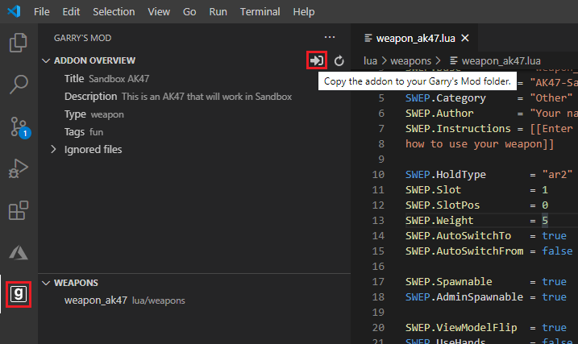

# Garry's Mod Addon Samples
This repository contains various sample addons for Garry's Mod. Each addon is self-contained and demonstrates some aspect of Garry's Mod development. 
You are welcome to modify or adapt any of these addons to create your own addon.

# Recommended Software
[Visual Studio Code](https://code.visualstudio.com) (Windows/Mac/Linux) for Garry's Mod Lua development. 
You should also get the following extensions:
* [GLua language support](https://marketplace.visualstudio.com/items?itemName=aStonedPenguin.glua) - Syntax highlighting, intellisense for Garry's Mod library functions
* [GMod SDK](https://marketplace.visualstudio.com/items?itemName=BadgerCode.gmod-sdk) - Workshop tools, addon creation tools, weapon samples and more

# Usage
* [Download the repository as a ZIP](https://github.com/BadgerCode/GMod-Addon-Samples/archive/master.zip) & unzip
    * Or used `git clone https://github.com/BadgerCode/GMod-Addon-Samples.git`
* Once downloaded
    * Open Visual Studio Code
    * Go to `File` -> `Open Folder`
    * Select any folder in the downloaded repository samples folder (e.g. `samples/hello-world`)
* Copy the addon to your Garry's Mod addon folder
    * This is easy if you're using the GMod SDK extension
    
    * Otherwise, [follow this guide](https://gist.github.com/BadgerCode/00600eab40556c6e8809590d263ea053) to find your Garry's Mod addons folder

# Samples
| Sample | Description |
| -- | -- |
| [Hello World](samples/hello-world/) | A basic sandbox weapon |
